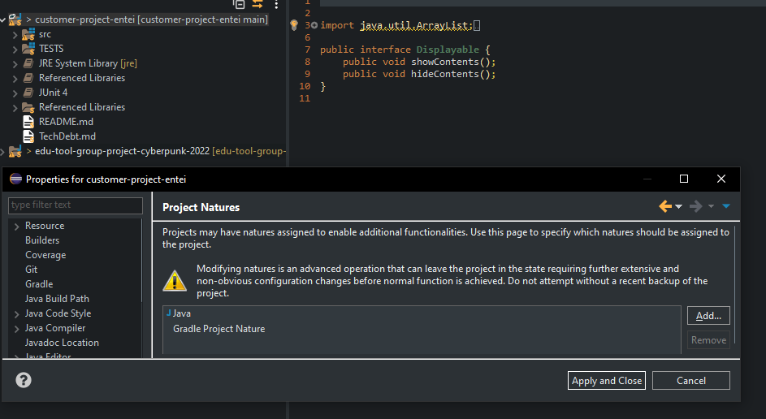
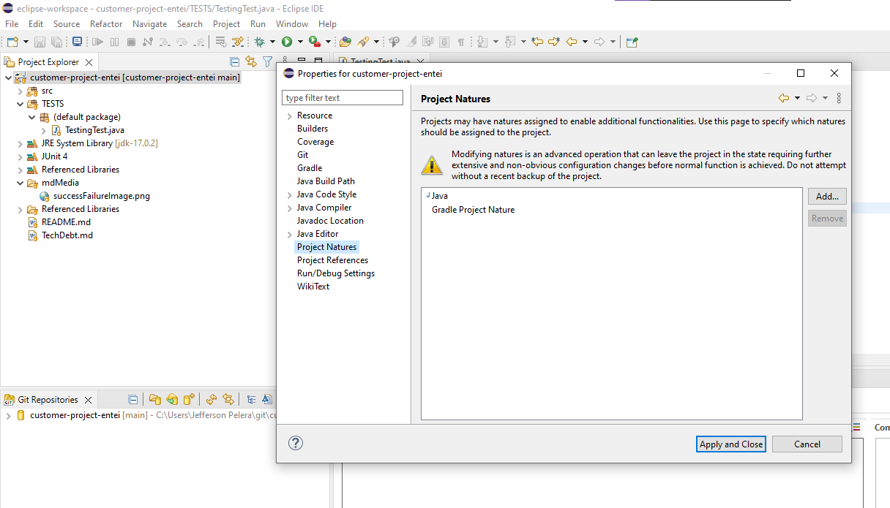
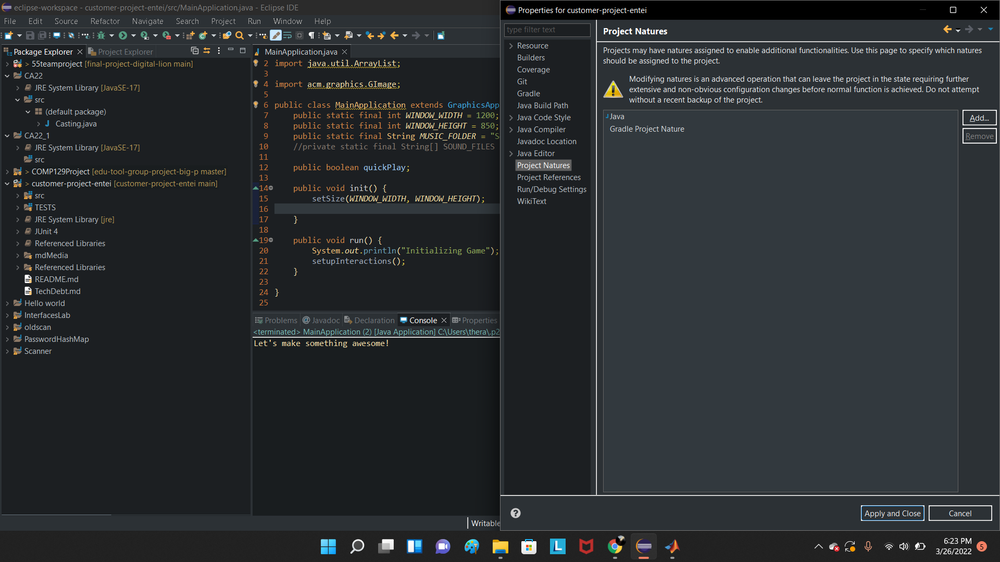
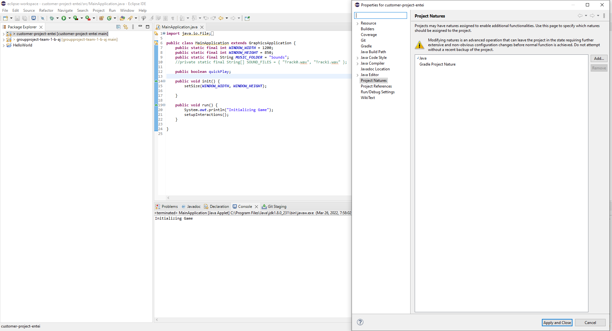
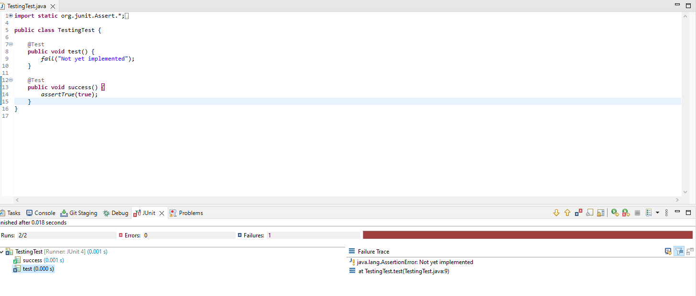

# Technical Debt
##  Tools
<ul>
<li>ACM Library</li>
<li>Eclipse</li>
<li>Gradle</li>
<li>Github Actions</li>
<li>Zenhub</li>
<li>Discord</li>
</ul>

## Engineering Practices | Processes
<ul>
<li>Writing clean code</li>
<li>Camelcase</li>
<li>Refactor into Util if used more than once</li>
<li>Actively Update Zenhub when stories are in progress/QA/Done</li>
<li>Ask for help/pair program session if there’s a roadblock or working on a new section of code</li>
<li>methods should ideally be no longer than 200 lines</li>
<li>Documentation for methods should include intent</li>  
<li>Scrum</li>
<ul>
<li>Weekly sprint</li>
<li>Retrospective</li>
<li>Mandatory standups</li>
<li>Complexity points</li>
</ul>
<li>Don’t push code if it has errors</li>
</ul>

## Gradle Install for members:

### Dustin:

### Jefferson:
  
 
 
### Lorena:
   

### Julian:
   

  
### Junit Testing Tested

